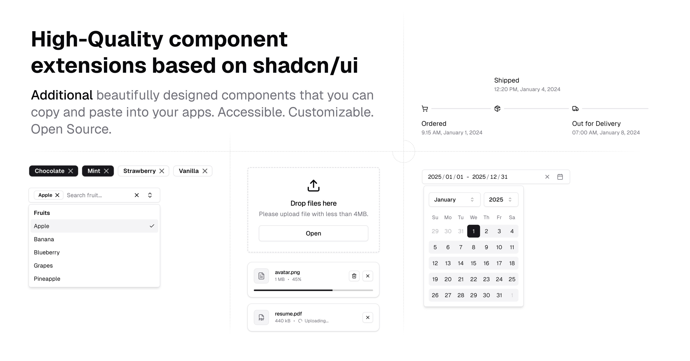

# junwen-k/ui-x

**Additional** accessible and customizable components that you can copy and paste into your apps. Free. Open Source.

## Documentation

Visit http://ui-x.junwen-k.dev/docs to view the documentation.

## License

Licensed under the [MIT license](https://github.com/junwen-k/ui-x/blob/main/LICENSE.md).

## Star History

Your support means a lot to us - if you find junwen-k/ui-x helpful, please consider giving it a star! ⭐

<a href="https://star-history.com/#junwen-k/ui-x&Date">
 <picture>
   <source media="(prefers-color-scheme: dark)" srcset="https://api.star-history.com/svg?repos=junwen-k/ui-x&type=Date&theme=dark" />
   <source media="(prefers-color-scheme: light)" srcset="https://api.star-history.com/svg?repos=junwen-k/ui-x&type=Date" />
   
 </picture>
</a>
